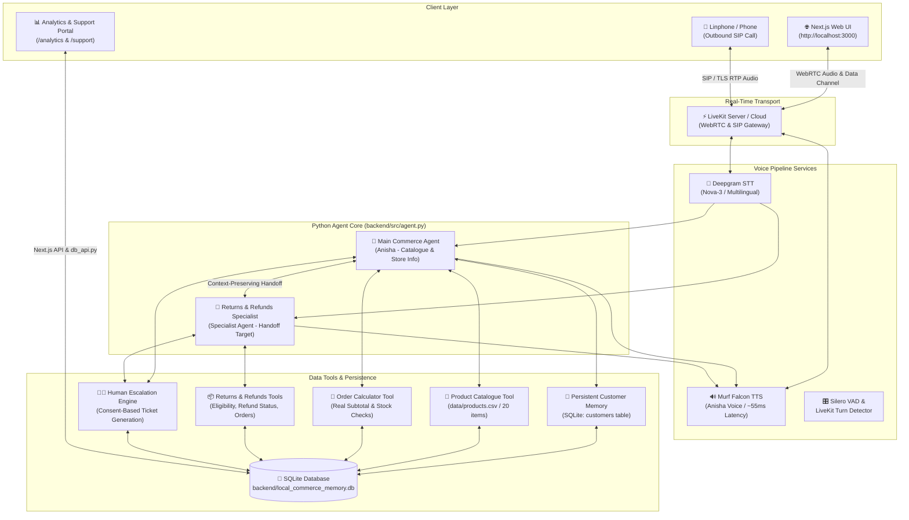

# Day 10 Project Audit — Local Commerce AI Voice Agent

**Project Name**: Local Commerce AI Voice Agent (Dukandar AI)  
**Track**: Local Commerce  
**Challenge**: 10 Days of Voice Agents — VoiceForBharat Edition  
**Repository**: [https://github.com/sahuanshika557-sys/murf-ai](https://github.com/sahuanshika557-sys/murf-ai)  
**Date**: August 15, 2026  

---

## 1. Project Overview

The **Local Commerce AI Voice Agent** (Dukandar AI) is an enterprise-grade, multilingual voice assistant designed specifically for local commerce businesses in India. It empowers customers to interact naturally via voice in **English, Hindi (Devanagari), or Hinglish (Roman Hindi)** to perform product catalogue lookups, verify stock availability, estimate order totals, track order statuses, manage return/refund requests through specialized agent handoffs, and escalate complex disputes to human support representatives with full consent management.

The system is built on a decoupled, real-time voice architecture using **LiveKit Agents** for WebRTC transport, **Murf Falcon TTS** for ultra-fast text-to-speech, **Deepgram Nova-3** for multi-language speech-to-text, **Google Gemini LLM** for intelligence, **SQLite** for customer memory, orders, analytics, and escalations, and **Next.js 15** for a responsive, state-aware frontend dashboard.

---

## 2. Existing Architecture



---

## 3. Implemented Features (Day 1 – Day 9 Audit)

| Day | Feature Area | Implementation Status | Verified Files & Components |
|---|---|---|---|
| **Day 1** | Voice Agent Foundation | ✅ Fully Functional | `backend/src/agent.py`, Deepgram Nova-3 STT, Murf Falcon TTS (`Anisha`), LiveKit RTC |
| **Day 2** | Persona, Guardrails & Refusals | ✅ Fully Functional | `MAIN_COMMERCE_SYSTEM_PROMPT`, Order placement refusal hard rule, System prompt leakage protection |
| **Day 3** | Responsive Voice UI & Agent States | ✅ Fully Functional | `frontend/app/page.tsx`, 5 agent visual states (`READY`, `CONNECTING`, `LISTENING`, `SPEAKING`, `ENDED`), mic error fallback |
| **Day 4** | Persistent Customer Memory | ✅ Fully Functional | `backend/src/database/memory.py`, SQLite `customers` table, `lookup_caller`, `save_caller_memory` (consent required), `forget_caller` |
| **Day 5** | Real-Time Catalogue & Order Tools | ✅ Fully Functional | `data/products.csv`, `lookup_product`, `calculate_order_total`, catalogue failure simulation flag |
| **Day 6** | Outbound Telephony Calling | ✅ Fully Functional | `backend/src/telephony/outbound/agent.py`, `dial.py`, Linphone SIP integration, opt-out enforcement, call log tracking |
| **Day 7** | Human Support Escalation | ✅ Fully Functional | `backend/src/tools/escalation_tool.py`, SQLite `escalations` table, mandatory user permission flow, reference ID (`LC-2026-XXXX`) |
| **Day 8** | Call Analytics & Performance Dashboard | ✅ Fully Functional | `backend/src/database/memory.py` (`calls` table), `frontend/app/analytics/page.tsx`, `db_api.py` CLI bridge |
| **Day 9** | Specialist Agent Handoff | ✅ Fully Functional | `handoff_to_returns_specialist`, `handoff_to_main_agent`, Returns & Refunds Specialist agent prompt & tools, context preservation |

---

## 4. Partially Implemented Features & External Requirements

1. **Outbound Telephony (SIP Credential Dependency)**:
   - *Status*: Code fully implemented (`backend/src/telephony/outbound/`).
   - *Requirement*: Requires active LiveKit Cloud account with Outbound SIP Trunk configured (`linphone-trunk`) and a registered Linphone account (`sip:username@sip.linphone.org`).
2. **Production Deployment Hosting**:
   - *Status*: Local single-command runner working via PowerShell (`.\start_app.ps1`) and Bash (`./start_app.sh`). Configuration files present for Vercel (`vercel.json`), Docker (`Dockerfile`), and Railway (`railway.toml`).

---

## 5. Known Limitations & Edge Cases

- **Catalogue Scope**: Catalogue currently relies on static local data in `data/products.csv` (20 items across 8 categories).
- **SQLite Single File Concurrency**: SQLite file `local_commerce_memory.db` is accessed directly by Python backend and bridged via `db_api.py` for Next.js API routes. For ultra-high scale concurrent production environments, upgrading to PostgreSQL is recommended.

---

## 6. How the Project Currently Runs

### Architecture Executables:
- **Frontend**: Next.js Dev Server on `http://localhost:3000` (`pnpm dev` inside `frontend/`)
- **Backend Agent**: Python LiveKit Worker connected to LiveKit server (`uv run python src/agent.py dev` inside `backend/`)
- **Local LiveKit Server**: Included `livekit-server.exe` (or LiveKit Cloud WSS URL)

### Single-Command Launch:
- **Windows (PowerShell)**: `.\start_app.ps1`
- **macOS / Linux (Bash)**: `./start_app.sh`

---

## 7. Important Project Files

```
murf-livekit-starter/
├── backend/
│   ├── src/
│   │   ├── agent.py                      # Main entrypoint & Returns Specialist
│   │   ├── database/
│   │   │   ├── schema.py                  # DDL schemas (6 tables)
│   │   │   ├── memory.py                  # Database CRUD & analytics logic
│   │   │   └── db_api.py                  # Next.js CLI bridge to SQLite
│   │   ├── services/
│   │   │   └── handoff_service.py         # Context passing structure
│   │   ├── telephony/outbound/
│   │   │   ├── agent.py                  # Outbound SIP worker
│   │   │   └── dial.py                   # SIP call dispatcher
│   │   └── tools/
│   │       ├── catalogue_tool.py          # Catalogue lookup tool
│   │       ├── order_tool.py              # Order calculation tool
│   │       ├── returns_refunds_tools.py   # Return & refund eligibility tools
│   │       └── escalation_tool.py         # Human escalation tool
│   └── tests/                             # Unit tests & LLM judge tests
├── data/
│   └── products.csv                      # Product dataset (Kanpur stores)
├── frontend/
│   ├── app/
│   │   ├── page.tsx                      # Primary voice assistant UI
│   │   ├── analytics/page.tsx            # Day 8 call analytics dashboard
│   │   ├── support/page.tsx              # Day 7 human support ticket manager
│   │   └── api/                          # Token, analytics & escalation routes
│   └── app-config.ts                     # UI configuration & accent colors
├── docs/
│   └── architecture.md                   # System architecture guide
├── DAY10_AUDIT.md                        # This audit document
├── DAY10_BLOG.md                         # Technical journey blog
├── DAY10_EVIDENCE.md                     # Feature verification matrix
├── DAY10_LINKEDIN_POST.md                # LinkedIn announcement post
├── README.md                             # GitHub portfolio repository README
└── start_app.ps1                         # PowerShell launch script
```

---

## 8. Required Environment Variables

### Backend (`backend/.env.local`):
```env
LIVEKIT_URL=wss://your-livekit-domain.livekit.cloud
LIVEKIT_API_KEY=your_livekit_api_key
LIVEKIT_API_SECRET=your_livekit_api_secret
MURF_API_KEY=your_murf_api_key
DEEPGRAM_API_KEY=your_deepgram_api_key
GOOGLE_API_KEY=your_google_gemini_api_key
AGENT_NAME=my-agent

# Optional Day 6 Outbound Call Variables
LIVEKIT_SIP_OUTBOUND_TRUNK_ID=ST_xxxxxx
LINPHONE_USERNAME=your_username
LINPHONE_SIP_ADDRESS=sip:your_username@sip.linphone.org
MAX_RETRIES=2

# Optional Simulation Flags
SIMULATE_CATALOGUE_FAILURE=false
```

### Frontend (`frontend/.env.local`):
```env
LIVEKIT_URL=wss://your-livekit-domain.livekit.cloud
LIVEKIT_API_KEY=your_livekit_api_key
LIVEKIT_API_SECRET=your_livekit_api_secret
AGENT_NAME=my-agent
```

---

## 9. Recommended Screenshots & Video Evidence

For portfolio presentation and blog publishing, capture the following visuals:
1. **Main UI (`/`)**: Voice visualizer in `LISTENING` and `SPEAKING` states with live transcript.
2. **Catalogue Card**: Dynamic tool response showing product availability (`Basmati Rice - ₹320 / 5kg`).
3. **Specialist Handoff Banner**: UI showing transfer state from Main Agent to Returns & Refunds Specialist.
4. **Human Support Portal (`/support`)**: Escalation ticket table listing reference ID `LC-2026-0001` with urgency badge (`HIGH`).
5. **Analytics Dashboard (`/analytics`)**: KPI cards (Total Calls, Success Rate, Average Duration) with failure breakdown pie chart and recent call logs.

---

## 10. Recommended Next Improvements

1. **PostgreSQL Migration**: Replace local SQLite with hosted PostgreSQL (e.g. Supabase / Neon) for multi-region serverless deployment.
2. **WhatsApp / SMS Notification Integration**: Automatically send SMS or WhatsApp confirmation when an escalation ticket is generated.
3. **Live Webhook Catalogue Sync**: Connect catalogue lookup tools directly to Shopify or WooCommerce APIs.
