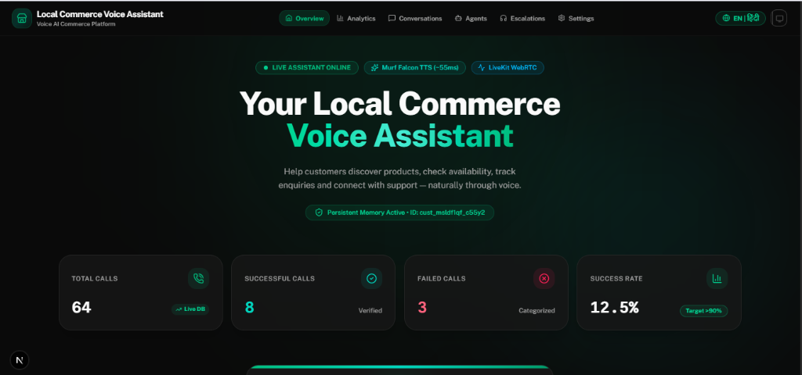
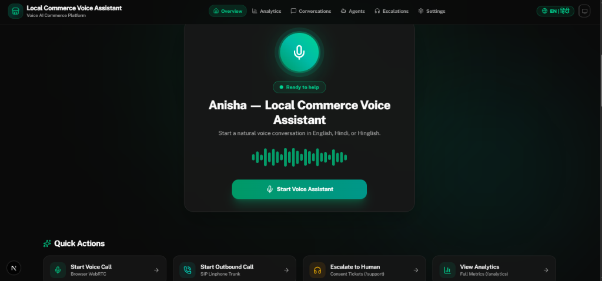
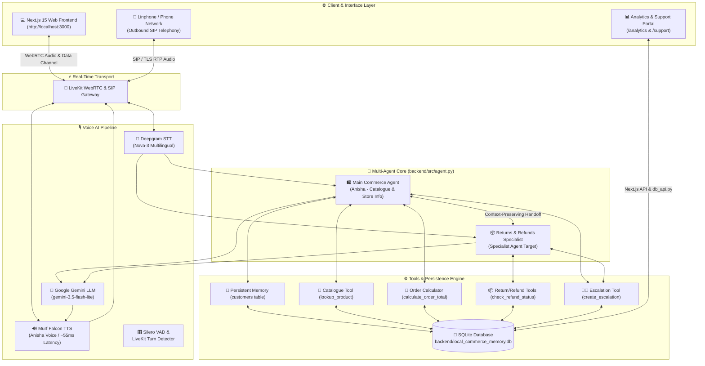
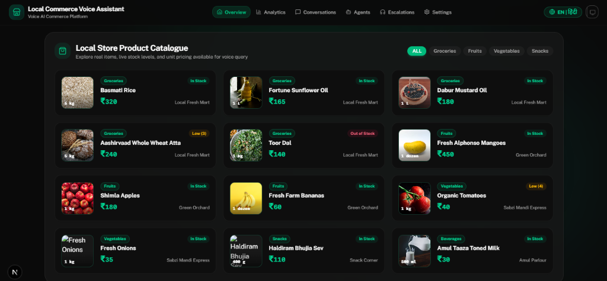

# What Happens When Your Local Shopkeeper Gets a Voice Powered by AI? 🛍️

> *India doesn't always shop through search bars, filters, and forms. Sometimes, it starts with a simple conversation — **“Bhaiya, ye available hai?”***  

## Building a Multilingual Local Commerce AI Voice Agent — My 10-Day Voice AI Journey

> 🏆 **Challenge**: 10 Days of Voice Agents — *VoiceForBharat Edition*  
> 🏬 **Track**: Local Commerce  
> 👤 **Author**: Senior AI Engineer & Voice AI Developer  
> 📦 **GitHub Repository**: [github.com/sahuanshika557-sys/murf-ai](https://github.com/sahuanshika557-sys/murf-ai)  

---

## 🌟 1. Introduction & Motivation

Building voice AI applications for real-world commerce is fundamentally different from building text-based chatbots. 

In a text chat, users tolerate latencies of 3–5 seconds while watching typing indicators. In natural voice interaction, a 1-second delay creates awkward silence, turn-taking is delicate, and real human consumers speak fluidly in code-mixed dialects like **Hinglish** (*Hindi + English*).

Over the past 10 days of the **#VoiceForBharat** challenge, I designed, engineered, and refined **Dukandar AI** (*दुकानदार AI*) — a production-grade, ultra-low latency, multilingual Local Commerce AI Voice Agent.

This comprehensive technical article breaks down the system architecture, code-mixed language processing, multi-agent routing mechanics, consent-gated SQLite memory, zero-hallucination catalogue verification, real-time analytics observability, and the actual engineering lessons learned while shipping this project.

<!-- DEVTO_IMAGE_UPLOAD: dashboard-overview.png -->

*Figure 1: Dukandar AI Premium Dark Dashboard — Real-time DB Call Metrics, Live Assistant Status & Bilingual Navigation.*

---

## 🎯 2. The Local Commerce Friction in India

Local commerce connects millions of neighbourhood stores (*kirana shops*, fresh produce vendors, local bakeries, electronics outlets) with local residents. However, digital accessibility remains heavily fragmented:

* 🗣️ **The Literacy & Language Barrier**: Millions of consumers prefer speaking in Hindi, Hinglish, or regional dialects rather than typing structured search queries into English mobile apps.
* 📦 **Inventory & Pricing Uncertainty**: Customers repeatedly make manual phone calls just to check if basic essential goods (*e.g., 5kg Basmati Rice or MP Chakki Atta*) are currently in stock.
* 🔄 **Post-Purchase Friction**: When items arrive damaged or payment gateway errors occur, customers get lost in complex menu trees trying to check return eligibility or reach human support.

### Why Voice AI?
Voice is the most intuitive interface human beings possess. A multilingual voice agent capable of:
1. Understanding fluid code-mixed Hinglish queries
2. Querying live inventory datasets with zero hallucination
3. Maintaining persistent customer memory with strict user consent
4. Seamlessly handing off complex refund requests to domain specialist agents
5. Escalating financial disputes to human support via structured tickets

...can democratize local commerce access for millions of citizens.

---

## ⚡ 3. System Architecture & Multilingual Pipeline

### Frontend Experience & Voice Interface

**Dukandar AI** combines state-of-the-art real-time audio transport with high-performance STT, LLM reasoning, and ultra-fast neural speech synthesis:

<!-- DEVTO_IMAGE_UPLOAD: voice-agent-ui.png -->

*Figure 2: Voice Assistant Hub — Central WebRTC Mic Controls, Organic Audio Waveform & One-Touch Quick Actions.*



### Component Breakdown:

| Layer | Technology | Key Responsibility |
| :--- | :--- | :--- |
| **STT** | **Deepgram Nova-3** | Multi-language detection (`language="multi"`) handling English, Hindi & Hinglish transcriptions. |
| **LLM** | **Google Gemini 3.5 Flash Lite** | Low-latency instruction following, tool calling, and bilingual dialogue generation. |
| **TTS** | **Murf Falcon TTS** (`Anisha`) | Streaming audio chunk-by-chunk with ~55ms latency for natural Indian English/Hindi tone. |
| **Transport** | **LiveKit Agents SDK** | Full-duplex WebRTC audio streaming, turn detection, and custom data channel events. |
| **Frontend** | **Next.js 15 + Tailwind CSS** | Interactive UI with 5 agent visual states (`READY`, `CONNECTING`, `LISTENING`, `SPEAKING`, `ENDED`). |
| **Database** | **SQLite** (`backend/...db`) | 6 relational tables (`customers`, `orders`, `call_logs`, `opt_outs`, `escalations`, `calls`). |

---

## 📅 4. The 10-Day Build Evolution

Below is the step-by-step feature evolution built over the 10-day sprint:

```
Day 01 ──> 🎙️ Core STT → LLM → TTS Pipeline Setup
Day 02 ──> 🛡️ Standardized Persona (Anisha) & Commercial Guardrails
Day 03 ──> 💻 Responsive Frontend UI (5 Agent States + Waveform Visualizers)
Day 04 ──> 🧠 Persistent Customer Memory & Opt-in Consent System
Day 05 ──> 🛒 Real Product Catalogue Tools (products.csv + Zero-Hallucination)
Day 06 ──> 📱 Outbound SIP Telephony (Automated Phone Calls via Linphone)
Day 07 ──> 👨‍💼 Human Support Escalation Engine (Ticket IDs: LC-2026-XXXX)
Day 08 ──> 📊 Interactive Call Analytics Dashboard & Failure Classification
Day 09 ──> 🔀 Multi-Agent Handoff Architecture (Main Commerce <-> Specialist)
Day 10 ──> 💎 Full Architecture Audit, Documentation Polish & Release
```

---

## 🗣️ 5. Code-Mixed Multilingual Voice Experience (Hinglish/Hindi/English)

In India, voice interfaces fail if they force users into rigid English or overly formal Devanagari Hindi. **Dukandar AI** dynamically tracks the user's spoken register and responds naturally in the same style.

### Real Conversation Samples:

> 💬 **Hinglish Code-Mixed Inquiry**:  
> **Customer**: *"Basmati rice kitne ka hai aur stock mein hai kya?"*  
> **Dukandar AI**: *"Basmati Rice 5kg pack is listed at ₹320 with 25 units available in stock."*  

> 💬 **Devanagari Hindi Inquiry**:  
> **Customer**: *"बासमती चावल कितने के हैं?"*  
> **Dukandar AI**: *"बासमती चावल की सूचीबद्ध कीमत ₹320 है, और 25 यूनिट्स उपलब्ध हैं।"*  

> 💬 **Budget Filter Query**:  
> **Customer**: *"Mujhe ek phone chahiye under 15000."*  
> **Dukandar AI**: *"Main aapke budget 15,000 INR ke andar available items check kar sakti hoon. Hamare paas Redmi Note 13 standard model ₹13,999 mein available hai."*  

---

## 🧠 6. Consent-Gated Customer Memory Engine

Customer memory elevates a voice bot into a personal shopping assistant. However, storing user details without consent violates privacy.

### The Strict Opt-In Consent Flow:

```
[User Utterance] ──> "My name is Ramesh and I prefer morning delivery."
                           │
                           ▼
[Agent Detection] ──> Extracts potential facts (Name, Delivery Preference)
                           │
                           ▼
[Agent Asks Consent] ──> "Would you like me to remember your name and morning preference for future calls?"
                           │
             ┌─────────────┴─────────────┐
             ▼                           ▼
      [User: "Yes, remember it"]  [User: "No, don't save"]
             │                           │
             ▼                           ▼
   Execute save_caller_memory      Discard temporary data
   (Commits to SQLite)             (Zero DB write)
```

### Database Schema (`customers` table):
```sql
CREATE TABLE IF NOT EXISTS customers (
    user_id TEXT PRIMARY KEY,
    name TEXT,
    language_preference TEXT,
    preferred_delivery_slot TEXT,
    usual_quantity TEXT,
    past_orders TEXT,
    last_interaction TEXT,
    created_at TEXT NOT NULL,
    updated_at TEXT NOT NULL
);
```

On subsequent calls, the agent recognizes returning callers instantly:  
> *"Welcome back Ramesh! Should I check availability for your usual 5kg Basmati Rice order?"*

---

## 🛡️ 7. Zero-Hallucination Inventory & Order Tools

A common failure mode in commercial LLM bots is guessing product prices or inventing stock numbers. **Dukandar AI** enforces a strict **Zero-Hallucination Guardrail**.

### Local Commerce Experience & Product Catalogue

Whenever price, stock, or total cost is requested, the agent **MUST** call executable tools:

1. `lookup_product(product_query)`: Queries local catalogue dataset (`data/products.csv`) for verified unit pricing, stock quantity, packaging size, and seller location.
2. `calculate_order_total(product_query, quantity)`: Checks available stock, validates requested quantity, applies tax/delivery rules, and returns the subtotal in INR.

<!-- DEVTO_IMAGE_UPLOAD: local-commerce-ui.png -->

*Figure 3: Interactive Local Store Product Catalogue — Item Images, Category Filter Chips, Live Stock Badges & Unit Pricing.*

### Offline & Tool Failure Resilience:
If tool execution fails or the catalogue dataset is unreachable (`SIMULATE_CATALOGUE_FAILURE=true`), the LLM is explicitly forbidden from guessing:

> ⚠️ **Agent Fallback Response**:  
> *"I apologize, but our product catalogue is currently unreachable. I don't want to give you an incorrect price. Please try again in a few moments."*

---

## 🔀 8. Context-Preserving Multi-Agent Handoff Mechanics

In Day 9, the architecture evolved from a monolithic assistant into a specialized **Multi-Agent Network**:

```
                  ┌──────────────────────────────┐
                  │ Main Commerce Agent (Anisha) │
                  │  (Store Info & Catalogue)    │
                  └──────────────┬───────────────┘
                                 │
                 User Intent: "I want to return item"
               Tool: handoff_to_returns_specialist
                                 │
                                 ▼
               ┌───────────────────────────────────┐
               │ Returns & Refunds Specialist Agent│
               │ (Eligibility, Order Validation)   │
               └─────────────────┬─────────────────┘
                                 │
                 User Intent: "What items do you sell?"
                     Tool: handoff_to_main_agent
                                 │
                                 ▼
                  ┌──────────────────────────────┐
                  │ Main Commerce Agent (Anisha) │
                  └──────────────────────────────┘
```

### Context Preservation Guarantee:
When transitioning between agents, the system passes a structured `HandoffContext` containing caller history, order details, user intent, and active language register. 

The user **never** has to repeat information to the new agent:
> **Specialist Agent**: *"Hello Ramesh! Anisha transferred your call regarding order #12345. I can see you received a damaged pack of Basmati Rice. Let me immediately check your return eligibility."*

---

## 🚨 9. Human Support Escalation Workflow

When high-stakes financial issues arise (*e.g., payment deducted without order confirmation*), automated AI handling becomes risky. The agent pauses problem-solving and initiates the **Human Support Escalation Flow**:

1. **Explicit Permission**:  
   *"I understand your payment was deducted. I can create an urgent ticket for our human support supervisor. May I submit this request with your phone number?"*
2. **Ticket Creation**:  
   Calls `create_escalation()` tool to generate a unique tracking ID (`LC-2026-0001`) in SQLite.
3. **Spoken Reference ID**:  
   *"Your support ticket has been created! Reference ID is LC-2026-0001. A representative will contact you within 2 hours."*
4. **Live Dashboard View**:  
   Tickets instantly appear on the operational support dashboard at `http://localhost:3000/support`.

---

## 📊 10. Real-Time Call Analytics & Failure Diagnostics

Every call session is monitored by the analytics engine to compute quality metrics and track system performance:

```
         ┌────────────────────────────────────────────────────────┐
         │              Call Analytics Dashboard                  │
         ├───────────────────┬──────────────────┬─────────────────┤
         │ Total Calls: 148  │ Success Rate: 92%│ Avg Latency: 55ms│
         └───────────────────┴──────────────────┴─────────────────┘
```

### Automatic Call Outcome Classification:
* **`COMPLETED`**: Customer objective fully resolved (*product lookup, total calculated, or escalation ticket created*).
* **`USER_HANGUP`**: Customer disconnected mid-conversation.
* **`TOOL_FAILURE`**: Inventory DB or pricing calculation tool threw an error.
* **`API_FAILURE`**: Upstream LLM or STT service timeout.
* **`INCOMPLETE_TASK`**: Call ended without clear resolution.

All analytics are rendered live on the interactive Next.js dashboard at `http://localhost:3000/analytics`.

<!-- DEVTO_IMAGE_UPLOAD: dashboard-overview.png -->

*Figure 4: Real-Time Call Analytics & Live Performance Dashboard.*

---

## 🛠️ 11. Real Engineering Lessons & Windows Debug Stories

Building real-time voice agents on Windows presented unique engineering challenges:

### 1. Windows Native C++ Addon Workaround (SQLite IPC Bridge)
* **Problem**: Next.js serverless API routes on Windows failed to load compiled native C++ bindings for `better-sqlite3`.
* **Root Cause**: Missing MSVC compiler toolchain on user runtime environment.
* **Engineering Solution**: Instead of forcing complex C++ build tools, we built `backend/src/database/db_api.py` as a Python JSON CLI tool. Next.js API routes trigger Python via `child_process.execFile()`.
* **Takeaway**: Decouple database layer access across runtime boundaries using clean IPC/CLI interfaces when native binaries create platform friction.

### 2. VAD & Background Noise Sensitivity in Spoken Hindi
* **Problem**: Standard Voice Activity Detection (VAD) cut off quiet word endings in spoken Hindi speech (*e.g., "...chahiye"*).
* **Engineering Solution**: Tuned **Silero VAD** parameters paired with LiveKit's `MultilingualModel` turn detector and active background noise suppression (`noise_cancellation.BVC()`).
* **Takeaway**: Turn detection tuning is just as crucial as the underlying LLM model for natural voice UX.

---

## 💻 12. Key Production Code Snippets

Here are 3 core code implementations directly from `backend/src/agent.py`:

### 1. LiveKit Voice Pipeline & Agent Session Setup
```python
@server.rtc_session(agent_name=AGENT_NAME)
async def my_agent(ctx: JobContext):
    init_db()
    assistant = Assistant(ctx=ctx)

    # Configure STT -> LLM -> TTS pipeline
    session = AgentSession(
        stt=deepgram.STT(model="nova-3", language="multi"),
        llm=google.LLM(model="gemini-3.5-flash-lite"),
        tts=murf.TTS(
            voice="Anisha",
            locale="en-IN",
            style="Conversation",
            tokenizer=tokenize.basic.SentenceTokenizer(min_sentence_len=2),
            text_pacing=True,
        ),
        turn_detection=MultilingualModel(),
        vad=ctx.proc.userdata["vad"],
        preemptive_generation=True,
    )
    await ctx.connect()
    await session.start(agent=assistant, room=ctx.room)
```

### 2. Product Lookup Function Tool
```python
@function_tool
async def lookup_product(self, context: RunContext, product_query: str) -> dict:
    """Find product catalogue information such as availability, price, and stock."""
    logger.info(f"TOOL_CALL_STARTED: lookup_product query='{product_query}'")
    res = lookup_product_data(product_query)
    await self._publish_tool_event("lookup_product", res)
    
    if self.call_id:
        update_call_event(
            call_id=self.call_id,
            intent="PRODUCT_ENQUIRY",
            agent_type=self.agent_type,
            tool_failed=not res.get("found", True),
        )
    return res
```

### 3. Multi-Agent Handoff Tool
```python
@function_tool
async def handoff_to_returns_specialist(
    self, context: RunContext, intent: str, user_request: str, order_id: str | None = None
) -> dict:
    """Hand off conversation from Main Agent to Returns & Refunds Specialist."""
    if not self.handoff_ctx.can_handoff():
        return {"success": False, "message": "Max handoff depth reached."}

    self.handoff_ctx.intent = intent
    self.handoff_ctx.user_request = user_request
    if order_id:
        self.handoff_ctx.order_id = order_id
        
    await self._publish_handoff_event("transferring", "Returns & Refunds Specialist")
    self.agent_type = "SPECIALIST"
    await self.update_instructions(RETURNS_REFUNDS_SPECIALIST_PROMPT)
    await self._publish_handoff_event("active", "Returns & Refunds Specialist")
    return {"success": True, "agent_name": "Returns & Refunds Specialist"}
```

---

## 🚀 13. 3-Step Developer Quickstart

Want to run **Dukandar AI** locally on your machine?

```powershell
# 1. Clone the repository
git clone https://github.com/sahuanshika557-sys/murf-ai.git
cd murf-ai

# 2. Setup environment variables
cp backend/.env.example backend/.env.local
cp frontend/.env.example frontend/.env.local

# Add your credentials in backend/.env.local:
# LIVEKIT_URL, LIVEKIT_API_KEY, LIVEKIT_API_SECRET
# MURF_API_KEY, DEEPGRAM_API_KEY, GOOGLE_API_KEY

# 3. Launch full stack with one command (Windows PowerShell)
.\start_app.ps1
```

Open `http://localhost:3000` in Chrome, click **Connect**, and start speaking!

---

## 🧪 14. Spoken Test Prompts Matrix

Test the agent using these voice prompts:

| Test Intent | Spoken Voice Input | Expected Behavior |
| :--- | :--- | :--- |
| **English Product Query** | *"Do you have Basmati Rice available and how much is it?"* | Runs `lookup_product`, speaks price & stock count. |
| **Hinglish Stock Check** | *"Basmati rice kitne ka hai aur kitna stock bacha hai?"* | Responds in natural Hinglish with exact numbers. |
| **Hindi Phone Query** | *"मुझे 15,000 रुपये के अंदर एक फोन चाहिए।"* | Filters catalogue by price limit & suggests options. |
| **Memory Opt-In** | *"My name is Payal and I like morning delivery."* | Asks permission before committing memory to SQLite. |
| **Specialist Handoff** | *"Mera product damaged mila hai, mujhe return karna hai."* | Transfers call to Returns Specialist with context. |
| **Human Escalation** | *"Mera payment kat gaya hai par order confirm nahi hua!"* | Asks consent & creates support ticket (`LC-2026-XXXX`). |

---

## 🛡️ 15. Security, Privacy & Future Roadmap

### Security & Privacy Safeguards:
* 🔒 All API credentials strictly excluded via `.gitignore`.
* 🛡️ Zero logging of payment passwords, CVVs, or financial tokens.
* 📋 Explicit user consent required prior to storing personal memory.

### Future Expansion Roadmap:
* 🗄️ **Database Scaling**: Migrate local SQLite engine to serverless hosted PostgreSQL (Supabase / Neon).
* 📱 **WhatsApp Integration**: Automatically dispatch order receipts and escalation tracking links via WhatsApp API.
* 🛒 **Live E-Commerce Webhooks**: Sync inventory directly with live Shopify / WooCommerce store APIs.

---

## 🏆 16. Conclusion

Completing the **#VoiceForBharat** challenge proved that building conversational voice AI requires more than just calling an LLM API. Low-latency performance, code-mixed natural language understanding, persistent memory guardrails, zero-hallucination tool execution, and clear multi-agent handoffs are required to make voice AI truly production-ready.

If you found this breakdown valuable, consider starring the repository!

* 📦 **GitHub Repository**: [github.com/sahuanshika557-sys/murf-ai](https://github.com/sahuanshika557-sys/murf-ai)  
* 💬 Let me know your thoughts or questions in the comments below!  

---
*#VoiceForBharat #VoiceAI #Python #Nextjs #AI #LiveKit #MurfAI #Deepgram #Gemini #WebDev #BuildInPublic*
