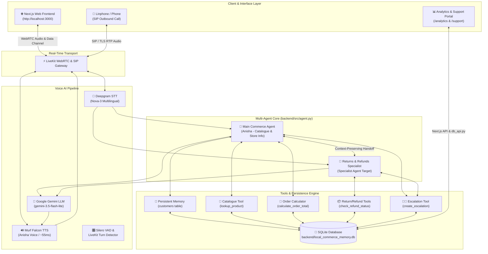

# Building a Multilingual Local Commerce AI Voice Agent — My 10-Day Voice AI Journey

**Author**: Senior AI Engineer & Voice AI Developer  
**Track**: Local Commerce  
**Challenge**: 10 Days of Voice Agents — VoiceForBharat Edition  
**Repository**: [https://github.com/sahuanshika557-sys/murf-ai](https://github.com/sahuanshika557-sys/murf-ai)  

---

## 1. Introduction

Building voice AI applications for real-world commerce is fundamentally different from building text-based chatbots. In text chat, users tolerate latencies of 3–5 seconds and read structured tables. In voice interaction, a 1-second delay feels awkward, turn-taking is delicate, and users speak naturally in code-mixed dialects like Hinglish.

Over the past 10 days of the **#VoiceForBharat** challenge, I designed, built, and refined **Dukandar AI** — a production-grade, multilingual Local Commerce AI Voice Agent. This article breaks down the engineering journey, architectural decisions, code-mixed language handling, multi-agent handoff mechanics, database persistence, real data tool integration, and practical lessons learned along the way.

---

## 2. The Problem

Local commerce in India connects millions of neighbourhood stores (*kirana shops*, fresh produce vendors, local electronics stores) with local consumers. However, existing digital commerce models create significant friction:

- **The Literacy & Language Barrier**: Millions of consumers prefer speaking in Hindi, Hinglish, or conversational speech rather than typing search terms into English mobile apps.
- **Inventory Uncertainty**: Customers spend time making manual phone calls just to check if essential goods (e.g., 5kg Basmati Rice or MP Chakki Atta) are currently in stock.
- **Post-Purchase Friction**: When items arrive damaged or payments fail, users struggle with confusing app menus to check return eligibility or reach human support.

**Why Voice AI?** Voice is the most intuitive interface human beings possess. A multilingual voice agent capable of understanding mixed Hindi/English queries, retrieving verified inventory data, managing persistent customer relationships, and escalating complex financial disputes can democratize local commerce for everyone.

---

## 3. What I Built

I built **Dukandar AI** — a responsive, low-latency, real-time voice assistant tailored for local commerce businesses.

### Key Capabilities:
1. **Real-Time Multilingual Voice Pipeline**: ~55ms TTS streaming latency in English, Hindi, and Hinglish.
2. **Persistent Customer Memory**: SQLite-backed customer profiles with explicit consent management.
3. **Real Data Catalogue Tools**: Instant product lookups (`lookup_product`) and order total calculations (`calculate_order_total`) connected to local inventory datasets (`data/products.csv`).
4. **Specialist Agent Handoff**: Seamless, context-preserving handoffs between the Main Commerce Assistant and a dedicated Returns & Refunds Specialist Agent.
5. **Consent-Gated Human Escalation**: Automated creation of structured support tickets with unique reference IDs (`LC-2026-XXXX`) for payment/refund disputes.
6. **Outbound SIP Telephony**: Automated phone calls for order status updates via LiveKit SIP trunking and Linphone with opt-out safety.
7. **Call Analytics Dashboard**: Real-time observability UI tracking call metrics, failure classifications, and channel performance.

---

## 4. System Architecture



---

## 5. Core Components

1. **Speech-to-Text (STT)**: **Deepgram Nova-3** configured with multi-language detection (`language="multi"`), offering accurate transcription for English, Hindi, and code-mixed speech.
2. **LLM Engine**: **Google Gemini 3.5 Flash Lite**, chosen for low-latency instruction following, tool calling, and bilingual dialogue generation.
3. **Text-to-Speech (TTS)**: **Murf Falcon TTS** (`voice="Anisha"`), streaming audio chunk-by-chunk with ~55ms latency for natural conversational cadence.
4. **Real-Time Transport**: **LiveKit Agents SDK**, handling WebRTC peer connections, full-duplex audio streaming, and data channel event publishing.
5. **Frontend UI**: Built with **Next.js 15**, Tailwind CSS, and Shadcn UI components. Features 5 distinct agent visual states (`READY`, `CONNECTING`, `LISTENING`, `SPEAKING`, `ENDED`), mic permission fallbacks, and transcript displays.
6. **Database Engine**: **SQLite** (`backend/local_commerce_memory.db`) managing 6 specialized tables: `customers`, `orders`, `call_logs`, `opt_outs`, `escalations`, and `calls`.
7. **Function Tools**: Structured `@function_tool` methods exposing Python logic directly to LLM decision layers.

---

## 6. Feature Journey (Days 1–10 Evolution)

- **Day 1 — Voice Agent Foundation**: Implemented core STT → LLM → TTS pipeline over LiveKit WebRTC using Python and Murf Falcon TTS.
- **Day 2 — Persona & Guardrails**: Standardized agent persona (Anisha), call objectives, system prompt protections, and strict order placement refusal guardrails.
- **Day 3 — Responsive Frontend & UX**: Built state-aware Next.js frontend supporting 5 visual agent states, microphone permission handling, and animated waveforms.
- **Day 4 — Persistent Customer Memory**: Integrated SQLite database layer to recognize returning customers, store preferences, and enforce explicit user consent.
- **Day 5 — Real Data Catalogue Tools**: Created `lookup_product` and `calculate_order_total` function tools backed by local inventory datasets (`data/products.csv`).
- **Day 6 — Outbound SIP Telephony**: Built automated outbound call dispatcher (`dial.py`) over LiveKit SIP trunking and Linphone with opt-out compliance.
- **Day 7 — Human Support Escalation**: Designed consent-gated escalation tool generating reference IDs (`LC-2026-XXXX`) with a dedicated support management portal (`/support`).
- **Day 8 — Call Analytics Dashboard**: Built complete call lifecycle tracker and analytics UI (`/analytics`) measuring call volume, success rates, duration, and failure reasons.
- **Day 9 — Specialist Agent Handoff**: Built context-preserving multi-agent routing between Main Commerce Agent and Returns & Refunds Specialist.
- **Day 10 — Portfolio & Documentation Polish**: Comprehensive documentation, audit, architecture diagrams, evidence matrix, and release preparation.

---

## 7. Multilingual Voice Experience

A critical requirement for local commerce in India is handling **code-mixing (Hinglish)** natively. Customers rarely speak in rigid formal English or complex pure Hindi.

### Code-Mixed Examples:

- **Hinglish Query**: *"Basmati rice kitne ka hai aur stock mein hai kya?"*
  - **Agent Response**: *"Basmati Rice 5 kg pack is listed at ₹320 with 25 units available in stock."*
- **Devanagari Hindi Query**: *"बासमती चावल कितने के हैं?"*
  - **Agent Response**: *"बासमती चावल की सूचीबद्ध कीमत ₹320 है, और 25 यूनिट्स उपलब्ध हैं।"*
- **Budget Query**: *"Mujhe ek phone chahiye under 15000."*
  - **Agent Response**: *"Main aapke budget 15000 INR ke andar available items check kar sakti hoon."*

The agent detects the user's active language register on every utterance and mirrors their choice dynamically without requiring manual language toggles.

---

## 8. Customer Memory & Consent Management

The agent maintains persistent customer relationships across sessions via SQLite:

```sql
CREATE TABLE IF NOT EXISTS customers (
    user_id TEXT PRIMARY KEY,
    name TEXT,
    language_preference TEXT,
    preferred_delivery_slot TEXT,
    usual_quantity TEXT,
    past_orders TEXT,
    last_interaction TEXT,
    created_at TEXT NOT NULL,
    updated_at TEXT NOT NULL
);
```

### The Consent Rule:
The agent **NEVER** saves customer facts automatically without permission.

1. **User**: *"My name is Ramesh and I prefer morning delivery."*
2. **Agent**: *"Would you like me to remember your name and morning delivery preference for future calls?"*
3. **User**: *"Yes, remember it."* (or *"Haan, yaad rakhna"*)
4. **Agent Tool**: Calls `save_caller_memory` to commit the data.
5. **Next Call**: Recognizes user immediately: *"Welcome back, Ramesh! How can I help you today?"*

---

## 9. Real Data Tools vs. LLM Hallucination Prevention

A common failure mode in commercial voice agents is allowing LLMs to guess product prices or confirm orders hypothetically. **Dukandar AI** enforces a **Zero-Hallucination Guardrail**.

If a user asks about pricing, stock, or order totals, the LLM is **forced** to execute real function tools:

- `lookup_product(product_query)`: Queries `data/products.csv` for unit price, stock quantity, unit size, and seller location.
- `calculate_order_total(product_query, quantity)`: Validates available inventory against requested quantity and calculates subtotal in INR.

If tools fail or are offline (`SIMULATE_CATALOGUE_FAILURE=true`), the agent refuses to guess:
> *"Sorry, the product catalogue is currently unreachable. I don't want to guess the price. Please try again in a moment."*

---

## 10. Human Support Escalation Workflow

When high-stakes issues occur (e.g. money deducted without order confirmation or damaged goods), autonomous resolution is unsafe. The agent pauses problem-solving and triggers the **Day 7 Escalation Engine**.

### Mandatory Consent Flow:
1. **Agent Explanation**: *"I can send a short summary of this issue to our support team. It will include your name, issue summary, and preferred contact method. May I share that with them?"*
2. **User Consent**: *"Yes, please share."*
3. **Tool Execution**: `create_escalation(...)` creates a ticket in the `escalations` SQLite table.
4. **Confirmation**: Agent speaks reference ID: *"Your support request has been created. Reference ID: LC-2026-0001."*

Tickets can be viewed and managed in real time on the Next.js support portal at `http://localhost:3000/support`.

---

## 11. Specialist Agent Handoff Mechanics

In Day 9, the architecture expanded from a single assistant to a **Multi-Agent System**.

```
Main Commerce Agent (Anisha)
       │
       ▼ (User intent: Return / Refund / Damaged Item)
  Tool: handoff_to_returns_specialist
       │
       ▼
Returns & Refunds Specialist Agent
       │
       ▼ (User query: Unrelated product availability question)
  Tool: handoff_to_main_agent
       │
       ▼
Main Commerce Agent
```

### Context Preservation:
When transferring, the Main Agent passes a structured `HandoffContext` object (user ID, order ID, intent, active language) to the Specialist so the user is never asked to repeat themselves:

> **Specialist**: *"Hi Payal! I received your return request context. I'll help you check the return eligibility for order #12345 right away."*

---

## 12. Call Performance Analytics

The Day 8 Call Analytics Engine tracks every call lifecycle in the SQLite `calls` table:

- **Success Definition**: Customer objective completed (product query answered, order total calculated, order verified, or escalation ticket created).
- **Failure Classification**: Categorized into `USER_HANGUP`, `INCOMPLETE_TASK`, `TOOL_FAILURE`, `API_FAILURE`, `NO_RESPONSE`, or `UNKNOWN`.
- **Metrics Tracked**: Total call count, overall success rate, channel breakdown (Browser vs SIP), average call duration, language distribution, and intent breakdown.

Analytics are rendered on the interactive dashboard at `http://localhost:3000/analytics`.

---

## 13. Real Engineering Challenges & Debug Lessons

During development, several complex issues arose:

### Challenge 1: Windows Subprocess Execution for SQLite Bridge
- **Problem**: Next.js API routes running on Windows could not directly compile native C++ SQLite addons (`better-sqlite3`) without native build tools.
- **Investigation**: Python backend already had full access to `sqlite3`.
- **Solution**: Built `backend/src/database/db_api.py` as a lightweight JSON CLI wrapper. Next.js API routes invoke `python db_api.py <command>` via `child_process.execFile()`, creating a clean, crash-free bridge.
- **Lesson**: Decouple database bindings across language boundaries using clean IPC/CLI contracts when native binaries cause platform friction.

### Challenge 2: Background Audio Noise in Multi-Language Speech Recognition
- **Problem**: Background noise caused Deepgram STT to output garbled phonemes for Hinglish speech input.
- **Investigation**: Standard VAD settings were cutting off quiet Hindi speech endings.
- **Solution**: Integrated **Silero VAD** with LiveKit's `MultilingualModel` turn detector and active noise cancellation (`noise_cancellation.BVC()`).
- **Lesson**: Turn detection and VAD tuning are just as critical as the STT model itself for spoken voice experience.

---

## 14. Code Examples from Implementation

Here are 3 core code snippets from the actual codebase (`backend/src/agent.py`):

### 1. LiveKit Voice Pipeline & Agent Session Setup
```python
@server.rtc_session(agent_name=AGENT_NAME)
async def my_agent(ctx: JobContext):
    init_db()
    assistant = Assistant(ctx=ctx)

    session = AgentSession(
        stt=deepgram.STT(model="nova-3", language="multi"),
        llm=google.LLM(model="gemini-3.5-flash-lite"),
        tts=murf.TTS(
            voice="Anisha",
            locale="en-IN",
            style="Conversation",
            tokenizer=tokenize.basic.SentenceTokenizer(min_sentence_len=2),
            text_pacing=True,
        ),
        turn_detection=MultilingualModel(),
        vad=ctx.proc.userdata["vad"],
        preemptive_generation=True,
    )
    await ctx.connect()
    await session.start(agent=assistant, room=ctx.room)
```

### 2. Product Lookup Function Tool
```python
@function_tool
async def lookup_product(self, context: RunContext, product_query: str) -> dict:
    """Find product catalogue information such as availability, price, and stock."""
    logger.info(f"TOOL_CALL_STARTED: lookup_product query='{product_query}'")
    res = lookup_product_data(product_query)
    await self._publish_tool_event("lookup_product", res)
    
    if self.call_id:
        update_call_event(
            call_id=self.call_id,
            intent="PRODUCT_ENQUIRY",
            agent_type=self.agent_type,
            tool_failed=not res.get("found", True),
        )
    return res
```

### 3. Context-Preserving Specialist Handoff Tool
```python
@function_tool
async def handoff_to_returns_specialist(
    self, context: RunContext, intent: str, user_request: str, order_id: str | None = None
) -> dict:
    """Hand off conversation from Main Agent to Returns & Refunds Specialist."""
    if not self.handoff_ctx.can_handoff():
        return {"success": False, "message": "Max handoff depth reached."}

    self.handoff_ctx.intent = intent
    self.handoff_ctx.user_request = user_request
    if order_id:
        self.handoff_ctx.order_id = order_id
        
    await self._publish_handoff_event("transferring", "Returns & Refunds Specialist")
    self.agent_type = "SPECIALIST"
    await self.update_instructions(RETURNS_REFUNDS_SPECIALIST_PROMPT)
    await self._publish_handoff_event("active", "Returns & Refunds Specialist")
    return {"success": True, "agent_name": "Returns & Refunds Specialist"}
```

---

## 15. Key Engineering Lessons Learned

1. **Voice UX ≠ Text UX**: Spoken responses must be concise (<20 words per turn). Raw JSON, bullet points, or markdown formatting destroy the conversational flow.
2. **Strict Guardrails are Mandatory**: Without explicit prompt rules, LLMs will attempt to confirm unverified transactions or make unauthorized promises.
3. **Explicit Consent Protects Privacy**: Memory persistence must be opt-in. Asking user permission builds trust and complies with privacy standards.
4. **Specialist Agents Improve Domain Accuracy**: Splitting complex tasks between a general assistant and specialized domain agents keeps system prompts focused and reduces hallucinations.
5. **Observability is essential**: Without automated call outcome tracking and failure categorization, debugging voice agents in production is impossible.

---

## 16. Beginner's Guide: Building Your First Voice Agent

If you want to build a voice agent from scratch, follow this conceptual flow:

```
[Audio Input] ──> STT (Speech-to-Text)
                     │
                     ▼
                 LLM Engine (Prompt + Tools + Memory)
                     │
                     ▼
                 TTS (Text-to-Speech Audio Stream) ──> [Audio Output]
```

### 3 Step Quickstart:
1. **Choose a Transport**: Use LiveKit Agents SDK for managed WebRTC connections.
2. **Connect Components**: Combine Deepgram (STT) + Google Gemini (LLM) + Murf Falcon (TTS).
3. **Add Tools**: Use `@function_tool` decorators in Python to give your agent access to real database queries.

---

## 17. Setup Guide

### Windows Setup:
```powershell
# Clone repo
git clone https://github.com/sahuanshika557-sys/murf-ai.git
cd murf-ai

# Install dependencies
cd backend; uv sync; cd ..
cd frontend; pnpm install; cd ..

# Configure environment
cp backend/.env.example backend/.env.local
cp frontend/.env.example frontend/.env.local

# Launch entire application with one command
.\start_app.ps1
```

---

## 18. Environment Variables Guide

Store API credentials in `backend/.env.local`:

```env
LIVEKIT_URL=wss://your-project.livekit.cloud
LIVEKIT_API_KEY=your_key
LIVEKIT_API_SECRET=your_secret
MURF_API_KEY=your_murf_key
DEEPGRAM_API_KEY=your_deepgram_key
GOOGLE_API_KEY=your_google_key
```

> [!CAUTION]
> Never expose secrets or push `.env.local` files to public GitHub repositories!

---

## 19. Practical Testing Prompts

Try these spoken test prompts with the running agent:

- **Product Inquiry (English)**: *"Do you have Basmati Rice available and how much is it?"*
- **Catalogue & Stock Check (Hinglish)**: *"Basmati rice kitne ka hai aur kitna stock bacha hai?"*
- **Hindi Inquiry (Hindi)**: *"मुझे 15000 रुपये के अंदर एक फोन चाहिए।"*
- **Memory Consent**: *"My name is Payal and I like morning delivery."*
- **Return Specialist Handoff**: *"Mera product damaged mila hai, mujhe return karna hai."*
- **Human Escalation**: *"Mera payment kat gaya hai par order confirm nahi hua. Support se baat karwao!"*

---

## 20. Security & Privacy Safeguards

- Secrets strictly ignored in `.gitignore`.
- Zero logging or storage of credit card numbers, CVVs, passwords, or OTPs.
- Explicit caller consent enforced prior to storing personal memory.

---

## 21. Future Improvements Roadmap

- **Database Scale**: Migrate local SQLite database to hosted serverless PostgreSQL (e.g., Supabase / Neon).
- **Messaging Integration**: Trigger automated WhatsApp or SMS confirmation messages when escalation tickets are created.
- **E-Commerce Webhooks**: Connect catalogue tools to live Shopify or WooCommerce APIs.
- **Evaluation Benchmark**: Expand automated LLM-as-judge unit tests for voice responses.

---

## 22. Conclusion

Completing the 10 Days of Voice Agents challenge has demonstrated how powerful low-latency voice AI can be when paired with proper architecture, real-time tools, persistent memory, and safety guardrails. Voice AI is not just a novelty — it is the future of accessible, frictionless digital commerce for Bharat.

- **GitHub Repository**: [https://github.com/sahuanshika557-sys/murf-ai](https://github.com/sahuanshika557-sys/murf-ai)
- **Live Demo**: `[ADD YOUR LIVE URL]`
