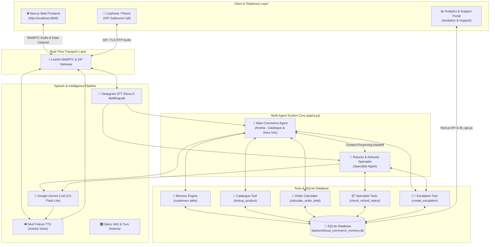

# Local Commerce AI Voice Agent

[](https://opensource.org/licenses/MIT)
[](https://murf.ai/api/docs/text-to-speech/streaming)
[](https://docs.livekit.io)
[](https://nextjs.org/)
[](https://www.python.org/)
[](https://deepgram.com)

A portfolio-quality, production-ready **Multilingual Local Commerce AI Voice Assistant** (Dukandar AI) built for the **"10 Days of Voice Agents — VoiceForBharat Edition"** challenge.

Powered by **Murf Falcon TTS** (~55ms streaming voice synthesis), **LiveKit Agents** (real-time WebRTC audio transport), **Deepgram Nova-3** (multilingual STT), **Google Gemini LLM**, **SQLite** (persistent memory, call analytics & escalations), and a **Next.js 15** responsive frontend.

---

## 1. Project Overview

The **Local Commerce AI Voice Agent** is a voice-first conversational AI built specifically for local shops and small businesses in India. It enables customers to converse naturally in **English, Hindi (Devanagari), or Hinglish (Roman Hindi)** without needing to type or navigate complex app menus.

### Core Capabilities:
- **Product Discovery & Catalogue Lookup**: Check availability, stock quantities, seller details, and unit pricing across local store inventory.
- **Order Total Estimation**: Calculate subtotals for multiple items with stock availability validation before purchase.
- **Order Status Verification**: Check real-time statuses (`PENDING`, `CONFIRMED`, `CANCELLED`) for past customer orders.
- **Returns & Refunds Specialist Handoff**: Automatically route return/refund requests to a specialized agent with context preservation.
- **Human Support Escalation**: Generate structured escalation tickets with unique reference IDs (`LC-2026-XXXX`) upon explicit customer consent for unresolved disputes.
- **Outbound Voice Telephony**: Make automated SIP telephone calls for order status updates with opt-out compliance.
- **Real-Time Call Analytics**: Monitor call volume, success rates, duration trends, and failure reasons on an interactive dashboard.

---

## 2. Problem Statement

Local commerce customers in India face significant friction when trying to place orders or resolve shopping queries:
- **Language & Literacy Barriers**: Traditional e-commerce apps require typing in formal English, excluding millions of local shoppers who speak Hindi, Hinglish, or regional dialects.
- **Inventory Uncertainty**: Customers waste time calling local shopkeepers just to confirm if items (e.g. 5kg Basmati Rice or MP Chakki Atta) are in stock.
- **Post-Purchase Anxiety**: Customers struggle to check return windows, refund statuses, or escalate financial disputes when order issues arise.

**Why Voice AI Matters**: Voice provides a frictionless interface that requires zero learning curve. By offering code-mixed Hindi/Hinglish speech understanding, instant catalogue lookup tools, transparent human escalation, and specialist agent routing, local commerce becomes accessible to everyone.

---

## 3. Key Features

- 🎙️ **Real-Time Voice Conversation**: Ultra-low latency (~55ms TTS streaming) powered by Murf Falcon and LiveKit WebRTC.
- 🗣️ **Multilingual Code-Switching**: Seamless support for English, Devanagari Hindi, and Roman Hinglish with dynamic language mirroring.
- 🧠 **Persistent Customer Memory**: SQLite-backed customer profiles (`local_commerce_memory.db`) with explicit consent management for remembering user names and preferences.
- 🛠️ **Real Data Catalogue Tools**: Real-time product search (`lookup_product`) and price calculation (`calculate_order_total`) connected to local inventory datasets (`data/products.csv`).
- 📞 **Outbound SIP Telephony**: Automated outbound calling via LiveKit SIP trunking and Linphone for order notifications with opt-out safety.
- 👨‍💼 **Human Support Escalation**: Consent-gated ticket creation generating unique reference codes (`LC-2026-XXXX`) stored in SQLite.
- 📊 **Call Performance Analytics**: Full observability dashboard (`/analytics`) tracking call lifecycles, success rates, channel breakdowns, and failure reasons.
- 🤖 **Specialist Agent Handoff**: Multi-agent architecture automatically transferring return/refund requests from Main Commerce Agent to Returns & Refunds Specialist.
- 🛡️ **Safety Guardrails**: Hard rules refusing unauthorized direct order placements, false refund confirmations, or system prompt leakage.
- 📱 **Responsive Frontend**: Modern Next.js UI (`/`) with 5 visual agent states (`READY`, `CONNECTING`, `LISTENING`, `SPEAKING`, `ENDED`), mic permission guidance, and live transcripts.

---

## 4. Architecture



---

## 5. Technology Stack

- **Speech-to-Text**: [Deepgram Nova-3](https://deepgram.com) (`language="multi"`)
- **Text-to-Speech**: [Murf Falcon](https://murf.ai) (`voice="Anisha"`, `locale="en-IN"`, streaming TTS)
- **LLM Engine**: [Google Gemini LLM](https://aistudio.google.com) (`gemini-3.5-flash-lite`)
- **Voice Agent Framework**: [LiveKit Agents SDK](https://docs.livekit.io/agents) (`livekit-agents ~1.4`)
- **Transport / Telephony**: LiveKit Cloud / Server WebRTC & LiveKit SIP Trunking
- **Database & Persistence**: SQLite (`backend/local_commerce_memory.db`) & Python `sqlite3`
- **Frontend Framework**: [Next.js 15](https://nextjs.org) (React 19, TypeScript)
- **UI & Styling**: Tailwind CSS, Shadcn UI (`components/ui`), Lucide Icons
- **Backend Package Manager**: [uv](https://docs.astral.sh/uv/) (Python 3.10+)
- **Frontend Package Manager**: [pnpm](https://pnpm.io/)

---

## 6. Project Structure

```
murf-livekit-starter/
├── backend/
│   ├── src/
│   │   ├── agent.py                      # Core entrypoint, Main & Specialist agents
│   │   ├── database/
│   │   │   ├── schema.py                  # DDL schemas for 6 SQLite tables
│   │   │   ├── memory.py                  # SQLite CRUD, analytics & escalation logic
│   │   │   └── db_api.py                  # CLI bridge connecting Next.js to SQLite
│   │   ├── services/
│   │   │   └── handoff_service.py         # Multi-agent handoff context manager
│   │   ├── telephony/outbound/
│   │   │   ├── agent.py                  # Outbound telephony agent worker
│   │   │   └── dial.py                   # SIP dispatcher script
│   │   └── tools/
│   │       ├── catalogue_tool.py          # Product search & inventory lookup
│   │       ├── order_tool.py              # Order subtotal & stock calculation
│   │       ├── returns_refunds_tools.py   # Return eligibility & refund status
│   │       └── escalation_tool.py         # Human support escalation ticket tool
│   ├── tests/                             # Pytest suite & LLM judge evaluations
│   ├── pyproject.toml                    # Python project & dependency configuration
│   └── .env.example                       # Backend environment template
├── data/
│   └── products.csv                      # Local product inventory dataset (20 items)
├── frontend/
│   ├── app/
│   │   ├── page.tsx                      # Primary responsive voice assistant UI
│   │   ├── analytics/page.tsx            # Day 8 call analytics performance dashboard
│   │   ├── support/page.tsx              # Day 7 human support ticket management portal
│   │   └── api/                          # Token generation & SQLite API routes
│   ├── app-config.ts                     # Branding, visualizer, & theme config
│   ├── package.json                      # Node.js dependencies
│   └── .env.example                       # Frontend environment template
├── docs/
│   └── architecture.md                   # Detailed technical architecture guide
├── DAY10_AUDIT.md                        # Phase 1 project audit report
├── DAY10_BLOG.md                         # Complete 10-day Voice AI technical article
├── DAY10_EVIDENCE.md                     # Feature verification matrix & checklist
├── DAY10_LINKEDIN_POST.md                # LinkedIn announcement post
├── README.md                             # Repository homepage documentation
├── start_app.ps1                         # PowerShell single-command runner (Windows)
└── start_app.sh                          # Bash single-command runner (macOS/Linux)
```

---

## 7. Installation

### Prerequisites:
- **Python**: 3.10 to 3.14
- **uv**: High-performance Python package manager (`pip install uv` or `winget install astral-sh.uv`)
- **Node.js**: 18+
- **pnpm**: `npm install -g pnpm`

### Step 1: Clone Repository
```bash
git clone https://github.com/sahuanshika557-sys/murf-ai.git
cd murf-ai
```

### Step 2: Install Backend Dependencies
```bash
cd backend
uv sync
cd ..
```

### Step 3: Install Frontend Dependencies
```bash
cd frontend
pnpm install
cd ..
```

---

## 8. Environment Setup

Create `.env.local` files for both backend and frontend from templates:

```bash
# Backend environment setup
cp backend/.env.example backend/.env.local

# Frontend environment setup
cp frontend/.env.example frontend/.env.local
```

Fill in your required API keys in `backend/.env.local`:
```env
LIVEKIT_URL=wss://your-project.livekit.cloud
LIVEKIT_API_KEY=your_livekit_api_key
LIVEKIT_API_SECRET=your_livekit_api_secret
MURF_API_KEY=your_murf_api_key
DEEPGRAM_API_KEY=your_deepgram_api_key
GOOGLE_API_KEY=your_google_gemini_api_key
AGENT_NAME=my-agent
```

Fill in your LiveKit connection details in `frontend/.env.local`:
```env
LIVEKIT_URL=wss://your-project.livekit.cloud
LIVEKIT_API_KEY=your_livekit_api_key
LIVEKIT_API_SECRET=your_livekit_api_secret
AGENT_NAME=my-agent
```

> [!CAUTION]
> Never commit `.env` or `.env.local` files to public repositories. Secrets are strictly ignored by `.gitignore`.

---

## 9. Running the Project

### Windows (PowerShell Single-Command Launcher):
```powershell
.\start_app.ps1
```

### macOS / Linux (Bash Single-Command Launcher):
```bash
chmod +x start_app.sh
./start_app.sh
```

### Running Components Individually:

1. **Start Backend Voice Agent**:
   ```bash
   cd backend
   uv run python src/agent.py dev
   ```

2. **Start Frontend Web Application**:
   ```bash
   cd frontend
   pnpm dev
   ```

Open your browser at `http://localhost:3000` to interact with the Voice Agent.  
Visit `http://localhost:3000/analytics` for the Call Analytics Dashboard.  
Visit `http://localhost:3000/support` for the Human Escalation Support Portal.

---

## 10. Testing Guide

### 1. Browser Voice Conversation
- Open `http://localhost:3000`, click **Start Voice Assistant**, and speak into your microphone.
- Check that the UI shifts smoothly between `LISTENING` and `SPEAKING` states.

### 2. Multilingual & Hinglish Speech
- **English**: *"Do you have Basmati Rice available?"*
- **Hinglish**: *"Basmati rice price kitna hai aur stock hai kya?"*
- **Hindi (Devanagari)**: *"बासमती चावल की कीमत क्या है?"*

### 3. Persistent Memory Test
- Say: *"My name is Ramesh and I prefer evening delivery."*
- Agent asks for consent: *"Would you like me to remember your name and preference?"*
- Say: *"Yes, remember it."*
- Disconnect call, refresh browser, restart call, and greet: *"Hi Anisha!"*
- Agent responds: *"Welcome back, Ramesh! How can I help you today?"*

### 4. Real Data Catalogue Tool Test
- Say: *"How much for 2 packs of Basmati Rice?"*
- Verify agent calls `calculate_order_total` and returns ₹640 (2 x ₹320).

### 5. Specialist Agent Handoff Test
- Say: *"Mujhe mera order return karna hai, item damaged mila tha."*
- Verify agent speaks handoff transition sentence and transfers control to Returns & Refunds Specialist.

### 6. Human Support Escalation Test
- Say: *"Mera payment kat gaya hai par order confirm nahi hua. Mujhe refund chahiye!"*
- Specialist requests permission to create escalation ticket.
- Say: *"Haan, support team ko bhej do."*
- Verify reference ID (e.g. `LC-2026-0001`) is spoken and visible in `/support` portal.

### 7. Automated Backend Unit Tests
```bash
cd backend
uv run pytest tests/test_catalogue.py tests/test_order_calculator.py tests/test_memory.py tests/test_escalation.py tests/test_handoff.py
```

---

## 11. Troubleshooting

| Issue | Root Cause | Resolution |
|---|---|---|
| **Microphone Permission Error** | Browser blocked microphone access | Click camera/mic icon in browser address bar, set permission to *Allow*, and click *Try Again*. |
| **LiveKit Connection Failure** | Invalid `LIVEKIT_URL` or API credentials | Verify credentials match your LiveKit Cloud console in both `backend/.env.local` and `frontend/.env.local`. |
| **TTS Audio Silence** | Invalid `MURF_API_KEY` | Verify Murf API Key in `backend/.env.local`. Ensure active API quota. |
| **Hindi STT Misinterpretation** | Noise in audio input | Use standard headset microphone and speak clearly near the mic. |
| **Database Lock Errors** | Concurrent process file access | Ensure SQLite file `local_commerce_memory.db` is not open in external database viewer software. |

---

## 12. Privacy & Security

- **Strict Key Protection**: All secrets are stored in `.env.local` files ignored by Git.
- **Explicit Consent Policy**: Personal facts (name, delivery slot) are saved to database memory ONLY after explicit user confirmation.
- **Sensitive Data Exclusion**: The agent NEVER requests or stores passwords, OTPs, credit card numbers, PINs, or CVV codes.
- **Escalation Data Minimization**: Escalation tickets record concise issue summaries rather than full raw audio transcripts.

---

## 13. Demo Links

- **Live Demo**: `[ADD YOUR LIVE URL]`
- **GitHub Repository**: [https://github.com/sahuanshika557-sys/murf-ai.git](https://github.com/sahuanshika557-sys/murf-ai.git)
- **Demo Video**: `[ADD YOUR VIDEO URL]`

---

## 📄 License

This project is licensed under the MIT License - see the [LICENSE](LICENSE) file for details.
