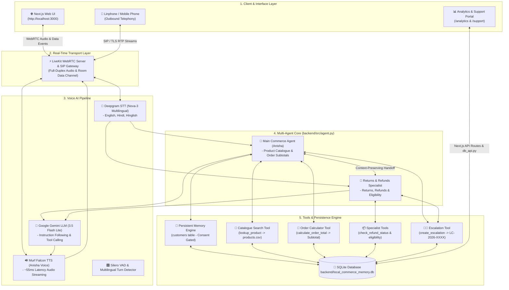
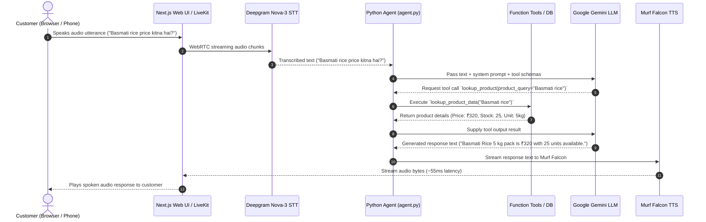
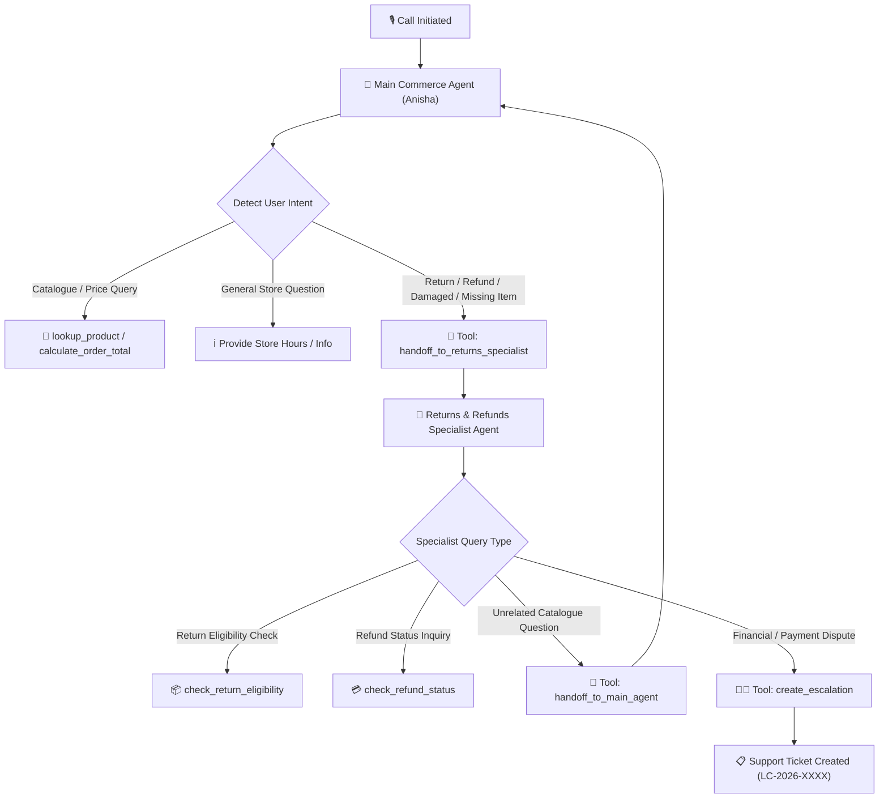
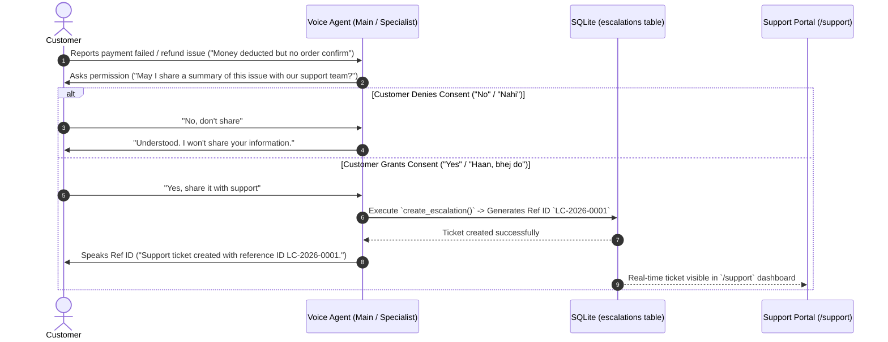
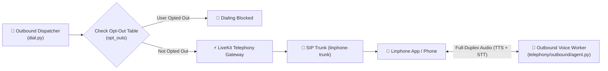
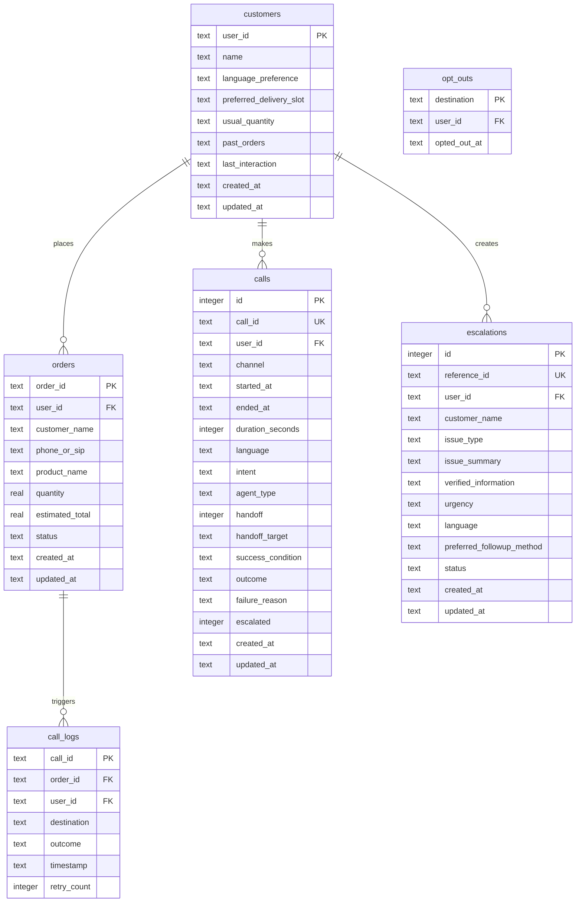

# System Architecture — Local Commerce AI Voice Agent

This document provides a detailed breakdown of the system architecture, voice streaming pipeline, multi-agent context handoff, persistent memory, real-time tools, human support escalation, and call analytics engine powering the **Local Commerce AI Voice Agent** (Dukandar AI).

---

## 1. High-Level System Architecture

---

## 2. Voice Pipeline Sequence Flow

---

## 3. Multi-Agent Handoff Architecture (Day 9)

---

## 4. Consent-Based Escalation Architecture (Day 7)

---

## 5. Outbound Telephony Architecture (Day 6)

---

## 6. Database Entity-Relationship Diagram

---

## 7. Component Summary Matrix

| Component | Technology | Primary File Location | Responsibilities |
|---|---|---|---|
| **Voice Agent Pipeline** | LiveKit SDK + Python | `backend/src/agent.py` | Orchestrates STT, LLM, TTS, VAD, and room connections |
| **Main Assistant** | System Prompt + Gemini | `backend/src/agent.py` | Product search, store info, subtotal calculation |
| **Returns Specialist** | System Prompt + Gemini | `backend/src/agent.py` | Return eligibility, refund status, damaged items |
| **Catalogue Tool** | Python CSV Reader | `backend/src/tools/catalogue_tool.py` | Queries `data/products.csv` for prices and stock |
| **Order Calculator Tool** | Python Math Engine | `backend/src/tools/order_tool.py` | Computes subtotals and checks stock sufficiency |
| **Memory Engine** | SQLite Database | `backend/src/database/memory.py` | Manages customer memory, consent, calls & escalations |
| **SQLite CLI Bridge** | Python Subprocess Bridge | `backend/src/database/db_api.py` | Bridges Next.js API routes with SQLite without native C++ addons |
| **Frontend Web App** | Next.js 15 + React 19 | `frontend/app/page.tsx` | Interactive voice UI with visual agent states |
| **Analytics Dashboard** | Next.js + Recharts/Lucide | `frontend/app/analytics/page.tsx` | Visualizes call volume, success rates & failure metrics |
| **Support Ticket Portal** | Next.js App Router | `frontend/app/support/page.tsx` | Displays human escalation tickets with status filters |
